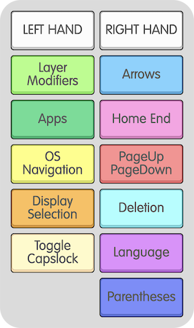
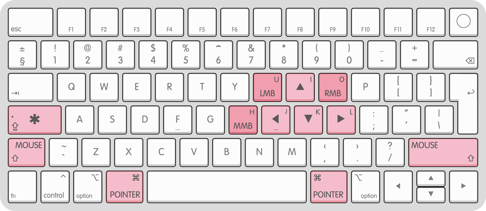

# HyperIJKL

[](https://github.com/RomanYuldashev/HyperIJKL/blob/master/README.md)
[](https://github.com/RomanYuldashev/HyperIJKL/blob/master/README-RU.md)

Схема переназначения клавиш для macOS, ориентированная на повышение продуктивности (ещё одна).  
Идея основана на проекте [CapsLock Enhancement](https://github.com/Vonng/Capslock) от [Vonng](https://github.com/Vonng), но с одним важным отличием:
навигация в стиле WASD, вместо стиля Vim.   
Для тех, кто больше привык к клавишам-стрелкам или управлению в шутерах ᗜωᗜ

Этот проект заточен под мои текущие рабочие задачи и не ставит перед собой цель охватить все возможные сценарии
использования, однако он легко поддаётся модификации, если вам понравится общая идея.

## Обзор

Клавиша `Capslock` превращается в новый модификатор – **Hyper** `*`, который позволяет делать много всего, 
не отрывая рук от основного ряда клавиатуры:

- Быстрая навигация и редактирование текста

- Удаление слов и строк одним нажатием

- Навигация в macOS: рабочие столы, приложения и вкладки

- Запуск и переключение между приложениями

- Управление мышью с клавиатуры

- ... и прочие полезные в работе улучшения

## Оглавление

<details>
  <summary>Развернуть</summary>

- [Требования](#требования)
- [Установка](#установка)
- [Описание](#описание)
   - [Общее](#общее)
      - [Легенда](#легенда)
   - [Текстовая навигация](#текстовая-навигация)
   - [Навигация в ОС](#навигация-в-ос)
   - [Управление мышью](#управление-мышью)
   - [Навигация по окнам левой руков](#навигация-по-окнам-левой-рукой)
   - [Приложения](#приложения)
   - [Центрирование курсора на мониторе](#центрирование-курсора-на-мониторе)
   - [Переключение источника ввода (языка)](#переключение-источника-ввода-языка)
- [Общая схема клавиш](#общая-схема-клавиш)
   - [Зоны](#зоны)
   - [Легенда](#легенда-1)
- [Назначение клавиш по слоям](#назначение-клавиш-по-слоям)
   - [Базовый слой](#базовый-слой)
   - [Выделение](#выделение)
   - [Навигация по словам](#навигация-по-словам)
   - [Выделение по словам](#выделение-по-словам)
   - [Навигация в ОС](#навигация-в-ос-1)
   - [Указатель мыши](#указатель-мыши)
   - [Колесо мыши](#колесо-мыши)
- [Включение функций HyperIJKL на экране логина](#включение-функций-hyperijkl-на-экране-логина)
- [Модификация HyperIJKL](#модификация-hyperijkl)
- [Расширенная установка](#расширенная-установка)
   - [Настройка DefaultKeyBindings.dict](#настройка-defaultkeybindingsdict)
   - [Настройка дополнительных сочетаний клавиш в IDEA](#настройка-дополнительных-сочетаний-клавиш-в-idea)
      - [Непосредственная модификация файла конфигурации клавиш (Быстрый способ)](#непосредственная-модификация-файла-конфигурации-клавиш-быстрый-способ)
      - [Альтернативный способ: настройка сочетаний клавиш через панель Settings (Прямолинейный способ)](#альтернативный-способ-настройка-сочетаний-клавиш-через-панель-settings-прямолинейный-способ)
- [О проекте](#о-проекте)

</details>

## Требования

- macOS

- [brew](https://brew.sh/)

## Установка

1. Установите Karabiner-Elements:
   
   ```bash
   brew install --cask karabiner-elements
   ```

2. [Скачайте файл конфигурации](karabiner://karabiner/assets/complex_modifications/import?url=https://raw.githubusercontent.com/RomanYuldashev/HyperIJKL/main/mac/hyperijkl.json) и позвольте Karabiner его загрузить;

3. Включите HyperIJKL в Karabiner-Elements:
   
   > Karabiner-Elements → Complex Modifications → Add rule → Enable all

4. Наслаждайтесь!

*Некоторые второстепенные функции HyperIJKL требуют для своей работы дополнительных шагов установки
(отмечены в разделе [Описание](#описание)). См. инструкцию в [Расширенная установка](#расширенная-установка).*

## Описание

### Общее

Зажмите `Capslock`, чтобы активировать режим **Hyper** `*`.  
Одиночное нажатие `Capslock` соответствует нажатию `esc`.  
Нажмите `Capslock + esc`, чтобы переключить режим Capslock.  

#### Легенда

|  `*`  |  `⌥`   |  `⇧`  |   `⌘`   | `␣`    |
|:-----:|:------:|:-----:|:-------:|--------|
| Hyper | option | shift | command | пробел |

### Текстовая навигация

| клавиша / слой |            `*`            |            `* ⌘`             |          `* ⌥`           |             `* ⌥ ⌘`              |
|:--------------:|:-------------------------:|:----------------------------:|:------------------------:|:--------------------------------:|
|      `i`       |           вверх           |    выделить строку сверху    |     параграф вверх*      |    выделить параграф сверху*     |
|      `j`       |           влево           |    выделить символ слева     |       слово влево        |       выделить слово слева       |
|      `k`       |           вниз            |    выделить строку снизу     |      параграф вниз*      |     выделить параграф снизу*     |
|      `l`       |          вправо           |    выделить символ справа    |       слово вправо       |      выделить слово справа       |
|      `u`       |           home            |      home с выделением       |     в начало строки      | выделить строку, курсор в начало |
|      `o`       |            end            |       end с выделением       |      в конец строки      | выделить строку, курсор в конец  |
|      `y`       |          page up          | выделить предыдущую страницу |   в начало документа*    |  выделить до начала документа*   |
|      `h`       |         page down         | выделить следующую страницу  |    в конец документа*    |   выделить до конца документа*   |
|      `n`       | удалить слева (backspace) |     удалить строку слева     |   удалить слово слева    |                -                 |
|      `m`       |  удалить текущую строку   |   выделить текущую строку    | переместить строку вниз  |                -                 |
|      `,`       |  удалить текущее слово*   |   выделить текущую строку*   | переместить строку вверх |                -                 |
|      `.`       |  удалить справа (delete)  |    удалить строку справа     |   удалить слово справа   |                -                 |
|      `[`       |             (             |       отменить (undo)        |            -             |                -                 |
|      `]`       |             )             |       повторить (redo)       |            -             |                -                 |
|     `esc`      |         capslock          |              -               |            -             |                -                 |

*\* требуется дополнительная настройка. См. [Расширенная установка](#расширенная-установка).*

### Навигация в ОС

Осуществляйте навигацию в macOS: рабочие столы, окна, вкладки, Mission Control и Launchpad.

| клавиша / слой |          `* ⇧`          |
|:--------------:|:-----------------------:|
|      `i`       |     Mission Control     |
|      `j`       |        Launchpad        |
|      `k`       |   предыдущая вкладка    |
|      `l`       |    следующая вкладка    |
|      `u`       | предыдущий рабочий стол |
|      `o`       | следующий рабочий стол  |
|      `y`       |      на весь экран      |
|      `h`       |  свернуть текущее окно  |

### Управление мышью

Управляйте указателем, кнопками и колёсами мыши с помощью клавиатуры.

| клавиша / слой |        `* ⇧`        |       `* ⌥ ⇧`       |
|:--------------:|:-------------------:|:-------------------:|
|      `i`       |   указатель вверх   |    колесо вверх     |
|      `j`       |   указатель влево   |    колесо влево     |
|      `k`       |   указатель вниз    |     колесо вниз     |
|      `l`       |  указатель вправо   |    колесо вправо    |
|      `u`       |  левая кнопка мыши  |  левая кнопка мыши  |
|      `o`       | правая кнопка мыши  | правая кнопка мыши  |
|      `h`       | средняя кнопка мыши | средняя кнопка мыши |

### Навигация по окнам левой рукой

Сочетания клавиш в этом разделе дублируют некоторые сочетания из [Навигации в ОС](#навигация-в-ос), но для левой руки. 
С их помощью можно управлять окнами и рабочими столами, держа мышь в правой руке.

| клавиша / слой |          `*`           |          `* ⌘`          |
|:--------------:|:----------------------:|:-----------------------:|
|      `w`       |   следующая вкладка    |   предыдущая вкладка    |ц
|      `s`       | следующий рабочий стол | предыдущий рабочий стол |
|      `x`       |         вперёд         |            -            |
|      `z`       |         назад          |            -            |

### Приложения

Запускайте приложения или переключайтесь на уже запущенное приложение.  
`* §` одним нажатием запускает несколько приложений, настроенных в `hyperijkl.yml`.  
Клавиша `§` расположена над клавишей `tab` на клавиатурах типа ISO (европейские), замените её на клавишу `` ` ``, 
чтобы получить похожий результат на клавиатурах типа ANSI (американские) (см. [Модификация HyperIJKL](#модификация-hyperijkl)).

| клавиша / слой |            `*`            |       `* ⌘`        |        `* ⌥`        |
|:--------------:|:-------------------------:|:------------------:|:-------------------:|
|      `e`       |          Outlook          |      Заметки       |     Thunderbird     |
|      `r`       |           IDEA            |       VSCode       |       DBeaver       |
|      `t`       |           iTerm           | Мониторинг системы | Системные настройки |
|      `d`       |          Postman          |       Docker       |        Lens         |
|      `f`       |          Finder           |      Forklift      |      Просмотр       |
|      `g`       |         KeepassXC         |      Spotify       |        IINA         |
|      `c`       |         Telegram          |    Rocket.Chat     |       Signal        |
|      `v`       |           Zoom            |  Microsoft Teams   |        Skype        |
|      `b`       |          Chrome           |      Firefox       |       Safari        |
|      `§`       | Запуск рабочего окружения |         -          |          -          |

### Центрирование курсора на мониторе

Нажмите `* 1`, чтобы центрировать указатель мыши на Мониторе 1. Сочетание клавиш работает с цифрами от 1 до 4.

| клавиша / слой |    `*`    |
|:--------------:|:---------:|
|      `1`       | монитор 1 |
|      `2`       | монитор 2 |
|      `3`       | монитор 3 |
|      `4`       | монитор 4 |

### Переключение источника ввода (языка)

| клавиша / слой |            `*`            |              `* ⌘`              |
|:--------------:|:-------------------------:|:-------------------------------:|
|      `;`       |            EN             |                -                |
|      `p`       |     источник ввода 2      |                -                |
|      `/`       |     источник ввода 3      |                -                |
|      `␣`       | предыдущий источник ввода | следующий источник ввода в меню |

Нажмите `* ;`, чтобы выбрать источник ввода EN.  
`* p` – выбрать второй источник ввода.  
`* /` – выбрать третий источник ввода.  
`* ␣` – выбрать предыдущий источник ввода (аналогично сочетанию клавиш `⌥ ␣` в macOS).  
`* ⌘ ␣` – выбрать следующий источник ввода в меню ввода
(обходит весь список источников ввода аналогично сочетанию клавиш `⌥ ⌘ ␣`).

Для работы переключателей источников ввода 2 и 3 может потребоваться дополнительная настройка.
Настройка производится заменой предустановленных кодов источников ввода на требуемые в файле `hyperijkl.yml`.
Также требуемые источники ввода должны быть настроены в macOS.
Переустановите скрипт после внесения изменений (см. [Модификация HyperIJKL](#модификация-hyperijkl)) и проверьте,
работают ли сочетания LANG2 и LANG3.

## Общая схема клавиш

### Зоны


### Легенда



## Назначение клавиш по слоям

*\* требуется дополнительная настройка. См. [Расширенная установка](#расширенная-установка).*

### Базовый слой


### Выделение


### Навигация по словам


### Выделение по словам


### Навигация в ОС


### Указатель мыши



### Колесо мыши


## Включение функций HyperIJKL на экране логина

Сочетания клавиш HyperIJKL могут работать на экране логина.

1. Перейдите в:

   > Karabiner-Elements → Misc

2. Нажмите `Copy the current configuration to the system default configuration`. Потребуется ввести пароль администратора.

## Модификация HyperIJKL

Вы можете модифицировать сочетания клавиш HyperIJKL следующим образом:

1. Откройте файл HyperIJKL/mac/hyperijkl.yml;

2. Отредактируйте назначения клавиш (для справки см. [Документация Karabiner](https://karabiner-elements.pqrs.org/docs/));

3. Выполните команду в директории `mac`:
   
   ```bash
   make all
   ```

4. Перейдите в:
   
   > Karabiner-Elements → Complex Modifications

5. Удалите все старые правила HyperIJKL;

6. Нажмите:
   
   > Add rule → Enable all
   
   под списком только что добавленных правил.

## Расширенная установка

Расширенная установка HyperIJKL позволяет использовать некоторые дополнительные сочетания клавиш, но требует более 
сложной первоначальной настройки, которая включает в себя модификацию сочетаний клавиш macOS и IntelliJ IDEA.

1. Установите Karabiner-Elements:
   
   ```bash
   brew install --cask karabiner-elements
   ```

2. Клонируйте репозиторий HyperIJKL:
   
   ```bash
   git clone https://github.com/RomanYuldashev/HyperIJKL.git
   ```

3. Выполните установочный скрипт в директории `mac` проекта:
   
   ```bash
   make all
   ```
   Этот шаг автоматически настраивает файл `DefaultKeyBindings.dict` в macOS. Подробнее см. [Настройка DefaultKeyBindings.dict](#настройка-defaultkeybindingsdict)

4. Включите HyperIJKL в Karabiner-Elements:
   
   > Karabiner-Elements → Complex Modifications → Add rule → Enable all

5. Настройте дополнительные сочетания клавиш в IDEA (см. [Настройка дополнительных сочетаний клавиш в IDEA](#настройка-дополнительных-сочетаний-клавиш-в-idea)).

### Настройка DefaultKeyBindings.dict

HyperIJKL требует модификации системного файла macOS DefaultKeyBindings.dict для работы сочетаний клавиш 
из расширенного списка. Если вы ранее не настраивали кастомные сочетания клавиш macOS — отлично!
В ином случае вам потребуется вручную слить имеющиеся настройки и настройки HyperIJKL в один файл.
Скрипт расширенной установки HyperIJKL выведет предупреждение, если обнаружит конфликт с имеющимися настройками.

### Настройка дополнительных сочетаний клавиш в IDEA

HyperIJKL utilizes a couple of text navigation actions that are supported by macOS but are rarely recognized by apps. 
To enable these actions in IntelliJ IDEA you will have to add shortcuts for them either through in-app Settings 
or by directly modifying configuration files.

HyperIJKL позволяет использовать некоторые приёмы текстовой навигации, которые поддерживаются macOS,
но редко распознаются сторонними приложениями. Чтобы включить эти сочетания клавиш в IntelliJ IDEA вам потребуется 
настроить их либо через панель Settings, либо напрямую – через редактирование файлов конфигурации.

#### Непосредственная модификация файла конфигурации клавиш (Быстрый способ)

1. Перейдите в директорию, содержащую файлы конфигурации IDEA (конкретное название директории зависит от установленной версии приложения):
   
   ```bash
   cd ~/Library/Application\ Support/JetBrains/[IntelliJIdea]
   ```

2. Если директория `[IdeaConfigBasePath]/keymaps` не существует, скопируйте её из директории `mac/idea` проекта HyperIJKL и вставьте сюда;

   Иначе перейдите в `keymaps`, откройте `macOS.xml` текстовым редактором и вставьте в него все блоки `<action>` из файла `mac/idea/keymaps/macOS.xml` проекта HyperIJKL;

3. Перейдите в `[IdeaConfigBasePath]/options/mac` и откройте `keymap.xml`. Убедитесь, что имя `active_keymap` соответствует файлу .xml в директории `keymaps`:
   
   > <active_keymap name="macOS" />

4. Перезапустите IDEA;

5. Проверьте, что настроенные сочетания клавиш работают в IDEA:

   > `* ⌥ i` → перейти в начало параграфа

   > `* ⌥ ⌘ i` → выделить предыдущий параграф

   > `* ⌥ k` → перейти в коней параграфа

   > `* ⌥ ⌘ k` → выделить следующий параграф

#### Альтернативный способ: настройка сочетаний клавиш через панель Settings (Прямолинейный способ)

1. Выполните предыдущие шаги [расширенной установки](#расширенная-установка) HyperIJKL;

2. Откройте IntelliJ IDEA;

3. Перейдите в:
   
   > Settings → Keymap → Find

4. Добавьте следующие сочетания клавиш:

   > Move Caret Backward a Paragraph → `* ⌥ i`

   > Move Caret Backward a Paragraph with Selection → `* ⌥ ⌘ i`

   > Move Caret Forward a Paragraph → `* ⌥ k`

   > Move Caret Forward a Paragraph with Selection → `* ⌥ ⌘ k`

## О проекте

Author：Roman Yuldashev ([RomanYuldashev@proton.me](mailto:RomanYuldashev@proton.me))

License: [Apache 2.0 License](LICENSE)

ᗜˬᗜ
